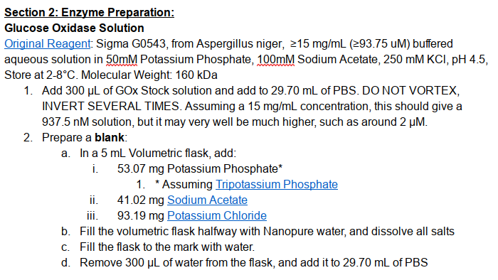
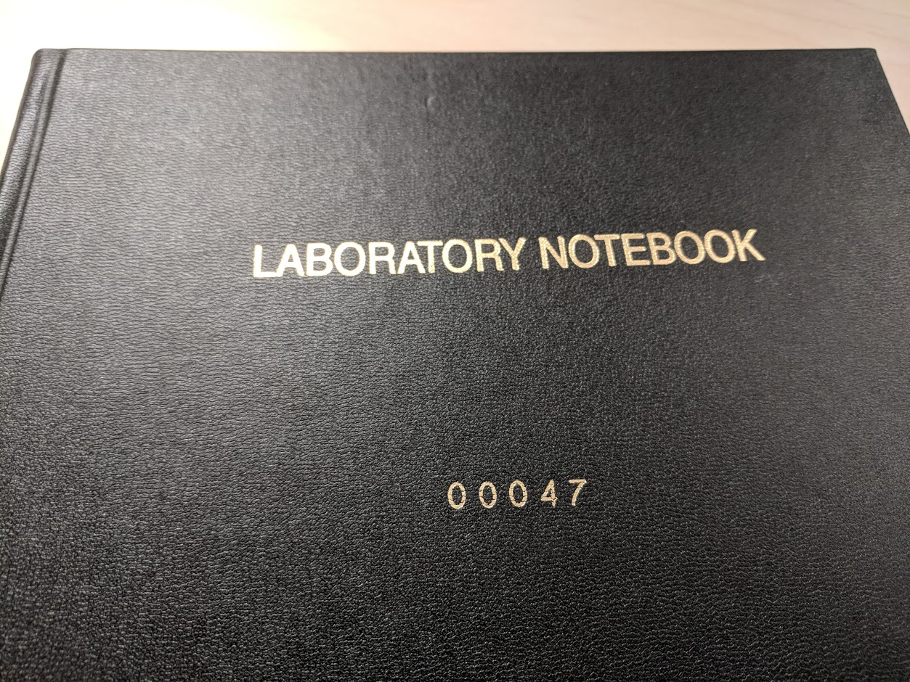

As a life sciences PhD, you spend most of your time doing experiments. Life science experiments are hard: 
- You have to follow cryptic instruction sheets like these:

- You have to precisely measure quantities that are fractions of drops.
- The results are not always immediately interpretable: 

- You end up doing small variations of the same experiments many, many times.

This is why all experimental life scientists use a **Lab Notebook**:

It's a place to store *everything*. You write in what you see, what you think; you tape in pictures, protocols, or graphs.

In the past couple of years, I've transitioned to doing more deep learning and machine learning experiments than biology experiments. As they grew more complex, I found myself wanting something that would help me track and monitor these computational experiments in a more effective way.

So I made [LabNotebook](https://github.com/henripal/labnotebook). I use it almost every day, and I have more than 25GB of experimental data stored in its database. The package's goal is to be a simple, flexible tool to monitor, record, save, and query all machine learning experiments.

In this post, I'll briefly describe the stack I used to build it, and why I made these choices.

# The Stack.
## Interface: pure Python

This one didn't take much to figure out. Experimental code is in Python, so LabNotebook had to be a Python package. You import it in your experimental scripts, specify what you want to monitor and save through simple functions.

What I wanted to avoid is forcing the user to design his experimental protocol around `labnotebook`. A lot of experiment management tools out there are designed to work only with command-line experiments; but an increasing number of scientists seem to use a combination of [Jupyter Notebooks](http://jupyter.org/) and more traditional `.py` files. Moreover, no-one really wants to write repetitive command line option parsing code: how do you store your configurations? What options are controllable from the command line VS. which are not? 

## Database: Postgres

The database world is finally emerging on the other side of the SQL vs NoSQL war. The traditional model of databases, *relational* databases, are essentially a collection of pre-defined `pandas` tables, which you can then query and join in a relatively inflexible way. Once the tables, or *schema* has been designed, that's it. 

The newer model, whose poster child is MongoDB, stores what can be described as Python dictionaries or JSON objects. There's no pre-defined schema, and you can change what fields you store every time you enter data.

This opposition, relational VS key-value databases, or SQL vs NoSQL, is now almost irrelevant. It's been resolved in the most obvious way possible: by allowing the storage of JSON objects in relational databases. This 'best of both worlds' paradigm is very well implemented in Postgres, where JSON queries are *as fast* as in a dedicated non-relational database like MongoDB!

For experimental data, the partially relational/partially JSON schema is perfect: every experiment will have a date, an id, an array of sub-steps associated to it, *and a JSON field describing its hyperparameters*. Every sub-step will have a training loss, a validation accuracy, *and a JSON field describing optional parameters*. So Postgres it is.

## Backend: Flask

[Flask](http://flask.pocoo.org/) is small and easy, super popular, has all the plugins you could ever dream of. [Django](https://www.djangoproject.com/) is better for large, batteries-included projects, and [Tornado](http://www.tornadoweb.org/en/stable/) is better when you need async capabilities. So Flask it is.

## Frontend: Vue.js

This part was the most exciting to me - I had done some web development before, but mostly used 'last-gen' tools like jQuery, and wanted to give [React](https://reactjs.org/) a whirl, since it seemed like the most popular shiny new thing. So I tried learning React. It just didn't click. The amount of boilerplate was staggering, and the syntax seemed very unnatural and contrived. 

After some more research, I learned about an ever newer shinier competitor, [Vue.js](https://vuejs.org/). I started [this excellent online course](https://www.udemy.com/vuejs-2-the-complete-guide/learn/v4/overview), and instantly loved it. To make a meaningless analogy, I think Vue is to React what PyTorch is to Tensorflow. Well designed, well thought out, easy to learn, but just as flexible. 

# Conclusion

I think the Flask/Postgres/Vue stack was perfect for this project; but I also think it's a very strong stack for *any new* fullstack project for someone who's more familiar with Python than Javascript (otherwise Node seems to be the obvious choice...).

I hope you give [labnotebook](https://github.com/henripal/labnotebook) a try, or follow me on [twitter](https://twitter.com/henripal) if you have any questions or comments. Thanks for reading!

