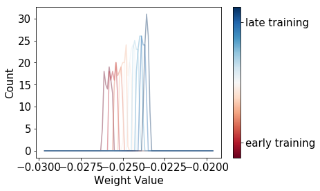
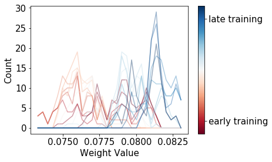
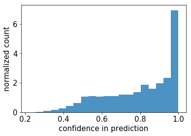

This is part 3 in a series of posts connecting physics and machine learning. [Part 1]() was a general introduction to the fundamental concepts of thermodynamics, and how energy minimization (in physics) is similar to loss minimization (in ML). [Part 2]() attempted to show how we could make this connection more precise by making our neural networks *probabilistic*, and we touched on how to do that using Monte-Carlo methods. Unfortunately, each iteration of a MC algorithm requires going through the entire dataset - which seems completely impossible for more modern datasets with millions of data points.

In this post, we'll be talking about [Langevin Dynamics](https://en.wikipedia.org/wiki/Langevin_dynamics), a common approach in the modeling of molecular systems. Langevin Dynamics surfaced in ML in 2011, when Welling and Teh published [Bayesian Learning via Stochastic Gradient Langevin Dynamics](https://www.ics.uci.edu/~welling/publications/papers/stoclangevin_v6.pdf). This approach was one of the alternatives proposed to make neural networks probabilistic while remaining tractable for big datasets. 

We'll show that this approach can be *extremely* useful in practice when it becomes critical for a deep learning algorithm to be able to recognize when data doesn't look like what it's been trained on. We'll show that an SGD trained model trained on MNIST still thinks it is seeing numbers when presented with letters, while the same architecture with SGLD will be able to tell you it doesn't know what letters are! We'll be using the [notMNIST dataset](http://yaroslavvb.blogspot.com/2011/09/notmnist-dataset.html):


As usual we're going to start by some physics - it'll make the ML easier to understand when we get to it!

# Langevin Dynamics

Sometime in 1827, a botanist, [Robert Brown](https://en.wikipedia.org/wiki/Robert_Brown_(botanist,_born_1773)), was looking at pollen grains in water, and saw them moving around randomly. A couple of years later, a budding young scientist, Albert Einstein, wrote a detailed paper explaining how the pollen's motion was caused by the random impacts of the water molecules on the pollen grain. This random walk was named **Brown**ian motion, after the botanist. Albert Einstein's paper spurred both an entire branch of applied math, [stochastic calculus](https://en.wikipedia.org/wiki/Stochastic_calculus) and an entire branch of physics, [molecular dynamics](https://en.wikipedia.org/wiki/Molecular_dynamics). This paper also probably caused a couple of [massive](https://en.wikipedia.org/wiki/Long-Term_Capital_Management) [market crashes](https://en.wikipedia.org/wiki/Financial_crisis_of_2007%E2%80%932008), but that's another story.

So, that pollen grain is sitting in water, and the water molecules are constantly bumping into it from random directions, propelling the pollen grain into a random walk. We want to write Newton's law $$\Sigma F = ma$$ for the pollen grain, and we already know that one of the forces is this random force coming from the water molecules. We'll make the hypothesis that this random force, $$\epsilon_t$$, is normally distributed. In macroscale physics, we usually neglect friction - but in our case, the entire hypothesis rests on the idea that the pollen grain is crowded; we need to include friction. If the grain has a velocity in a given direction, there will be way more water molecule impacts towards the front of the molecule: the friction force will tend to slow the pollen grain down. Therefore, we can write the friction force as proportional to the opposite of our molecule's velocity $$-\gamma\mathbf{v}$$. The $$\gamma$$ is the friction coefficent. So, here's our first shot, including a generic $$F$$ for any external forces:

$$\begin{eqnarray}
m\mathbf{a}_t = -\gamma \mathbf{v}_t + \epsilon_t + \mathbf{F}
\end{eqnarray}$$

And that's our first version of the *Langevin Equation*, or underdamped Langevin Equation! Remember, this isn't a classic equation because $$\epsilon_t$$ is a normally distributed random variable. Now, let's make this even simpler. The pollen grain in water is really very light, and the friction and random forces are going to be significantly higher than the acceleration times mass term; we often say the dynamics are 'overdamped'. Without further ado, let's forget about the first term and write the *Overdamped Langevin Equation*:
 
$$\begin{eqnarray}
0 = -\gamma \mathbf{v}_t + \epsilon_t + \mathbf{F}
\end{eqnarray}$$

That's it! We just need to make two more little adjustments then we'll move back to ML. First, we'll discretize the velocity term. Second, we've so far talked about energies more than forces, and a force is simply the derivative of the energy, so we'll write the equation with energies. After some rearranging:

$$\begin{eqnarray}
\mathbf{x}_{t+\Delta t} = \mathbf{x}_{t} + \frac{\Delta t}{\gamma} \mathbf{\epsilon}_t + \frac{\Delta t}{\gamma} \nabla E 
\end{eqnarray}$$

If you have an ML background, take a little time to look at this equation. Remember that we started saying that energies in physics and loss functions in ML are analogous. Does the equation above feel a little familiar? Yup, that's a gradient descent update with an added random term. From there, it's just a hop to...

# Stochastic Gradient Langevin Dynamics

## Vanilla SGD

Let's write a traditional SGD update step. It's very much like our equation above, except now we calculate our energy on a subset of the data. We'll write that energy $$E_{MB(t)}$$, for energy (loss function) of the minibatch at time $$t$$.

$$\begin{eqnarray}
\mathbf{x}_{t+\Delta t} = \mathbf{x}_{t} + \lambda_t \nabla E_{MB(t)} 
\end{eqnarray}$$

Here, $$\lambda_t$$ is our learning rate for step $$t$$. We're all used to dropping this rate in steps and doing early stopping, but in an idealized world, to find the absolute best minima you can, you lower $$\lambda_t$$ progressively to 0, so let's make that hypothesis for now.

The energy per minibatch term is a little mysterious. To understand it a little better, imagine a world where you had access to the *real* gradient of the loss function, $$\nabla E$$. Let's further make the approximation that the real gradient is the same as the gradient over the entire dataset. Then, we can split our minibatch gradient as the sum of the *real* gradient and an error term linked to the fact that we're only computing it on that minibatch:

$$\begin{eqnarray}
\nabla E_{MB(t)} = \nabla E + \eta_t
\end{eqnarray}$$

where $$\eta_t$$ is the error that we're doing at each step because we're minibatchin'. What does $$\eta_t$$ look like? It's a random variable, but a fun kind, that depends on the variability of your data. Under the hypothesis that the gradient on the entire dataset is $$\nabla E$$, then the errors per minibatch will compensate each other and:

$$\begin{eqnarray}
\mathbb{E}[\nabla E_{MB(t)}]  & = & \nabla E  \\
\mathbb{E}[\eta_t] & = & 0 
\end{eqnarray}$$

Ok, so $$\eta_t$$ is like another error term! The other thing to note is that the variance of this error term is definitely upper bounded - for a given dataset, the discrepancy between the gradient on a minibatch and the 'real' gradient is never going to explode. What this entails is that as $$\lambda_t$$ goes to 0 in our SGD updates, the error term's variance goes to 0 like $$\lambda_t^2$$ (because $$\mathbb{V}[\lambda_t \eta_t] \propto \lambda_t^2 $$).

What this all means is that, in the end, the noise from the minibatch updates will be squashed, the learning rate will go to zero, and our weights will settle in (hopefully) a configuration that minimizes our loss function.

In and of itself, the presence of this minibatch noise term might be responsible for some 'Bayesianization' of SGD, and is definitely responsible for *some* regularization. This question is at the cutting edge of Bayesian DL research - see Mandt, Hoffman and Blei's paper from 2017: [Stochastic Gradient Descent as Approximate Bayesian Inference](https://arxiv.org/abs/1704.04289).

Ok, so we now have a nice view of SGD as giving us one solution - let's add some Langevin noise and get probability distributions for our weights!

## Stochastic Gradient Langevin Dynamics

We now have everything we need to understand what Welling and Teh did in their paper: they took the traditional SGD updates and added langevin noise. Let's combine our notations from the two previous sections and see what that looks like:

$$\begin{eqnarray}
\mathbf{x}_{t+\Delta t} = \mathbf{x}_{t} + \lambda_t \nabla E_{MB(t)} +  \epsilon_t
\end{eqnarray}$$

Don't worry about the physics constants who disappeared from in front of the $$\epsilon_t$$ - just assume they got lumped into $$\epsilon_t$$'s variance. We'd said already that $$\epsilon_t$$ was a gaussian term, with mean 0 - but what should its variance $$\sigma_t$$ be? We've seen above that the minibatch noise decreased like $$\lambda_t^2$$. Remember that what we want is for our weights to converge to samples of their posterior distribution by adding noise at each step - so we want our noise to dominate the minibatch noise.

The way the authors went about doing this is by choosing $$\sigma_t^2 = \lambda_t$$; if we do this, the injected noise will dominate the minibatch noise at the end of the training process! 

All right - you can breathe a sigh of relief! We're done with the math and I'm going to show you how simple this is to implement in PyTorch. We're also going to try to benchmark this algorithm to see if more recent developments make this any better.

# PyTorch Stochastic Gradient Langevin Dynamics

Finally, some code and results! The project's repo is [here](https://github.com/henripal/sgld), and [here is](https://github.com/henripal/sgld/blob/master/nbs/mnist.ipynb) the jupyter notebook I used to generate the plots.

In this post, I particulary want to highlight how simple this was to implement by extending PyTorch's Optimizer class, essentially copy-pasting the SGD optimizer and adding a couple of characters of code. Then we'll look at some very interesting results with, I think, very important potential real world applications.

## Implementation

PyTorch stochastic gradient descent optimizer has a lot of extra things going on: momentum, weight decay, and dampening. You can see it [here](https://github.com/pytorch/pytorch/blob/master/torch/optim/sgd.py).

All the work is done in a single line at the end:

```python
p.data.add_(-group['lr'], d_p)
``` 

What this does is takes our parameters `p`, and adds to it `-group['lr'] * d_p`, where `d_p` is our gradient and `-group['lr']` is the learning rate.

In my implementation of SGLD, I essentially deleted the extra stuff, made the learning rate a parameter of the step function, and added gaussian noise to this update. You can look at the code [here](https://github.com/henripal/sgld/blob/master/sgld/sgld/sgld_optimizer.py), but the new code is mostly this:

```python
size = d_p.size()
langevin_noise = Normal(
    torch.zeros(size),
    torch.ones(size) * np.sqrt(lr)
)
p.data.add_(-group['lr'],
            d_p + langevin_noise.sample())
```

Nothing more than adding gaussian noise to our update. Everything else unchanged. Let's now take a look at the results.

## Results

I'll spare you the amount of hyperparameter tuning there is to do for SGLD to work well; let's just look at what happens to a single parameter when we train a CNN on the MNIST dataset, without Langevin noise:



These are distributions of parameter values over a rolling window of training steps. As you can see, these distributions for SGD are relatively narrow, and look more like a dirac function than like a proper probability distribution.

Now for the same weight's distribution (using the same x-axis scale) with SGLD:



Nice - we've managed to create a much *wider* distribution of weights, even as we get to an optimal solution in terms of training error!

This looks nice, but what is it *good* for? Let's look at what happens to our SGD-trained model when it's given data it shouldn't recognize.

I downloaded the [NotMNIST dataset](http://yaroslavvb.blogspot.com/2011/09/notmnist-dataset.html), which are letters from A-J, taken from different fonts, but with the same size as the MNIST dataset:


What happens when we feed these to our SGD algorithm?




Ouch. Our fancy deep learning model, trained on MNIST, is *very often* going to look at us with a straight face and assert that a letter is a number, with a very high confidence.

Now what about our Bayesian model? Let's compare the two:


This is impressive. Sure, we added some complexity to our model, but it has gained the ability to say "I don't know" when seeing data it hasn't been trained on.

I'm sure if you've read up to here you have both objections (how about regularizing the model? how about dropout Bayes?), and are hopefully excited about what this means for the more sensitive applications of deep learning, like healthcare or self-driving cars!

## Some more reading

I realized I've never linked in these series to one of the most active researchers in Bayesian Deep Learning - check out Yarin Gal's blog and papers [here](http://www.cs.ox.ac.uk/people/yarin.gal/website/index.html). His thesis, 'Uncertainty in Deep Learning' is a great read.

Also, if you've enjoyed this, you might enjoy taking a look at  [Part 1]()   and [Part 2]().

---
This work was supported by the ARO grant “Thermodynamics of Statistical Learning”, PI: H. Hess, ARO W911-NF-17-1-0107